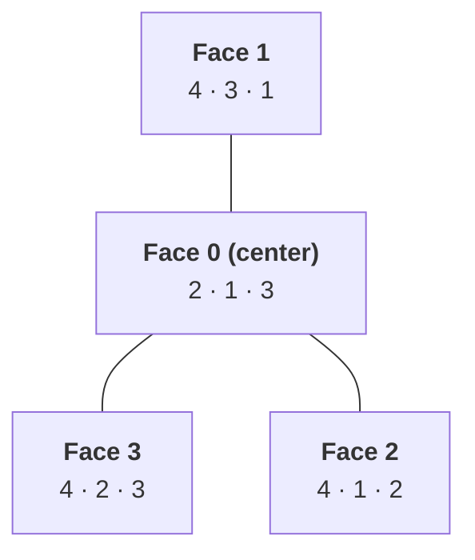
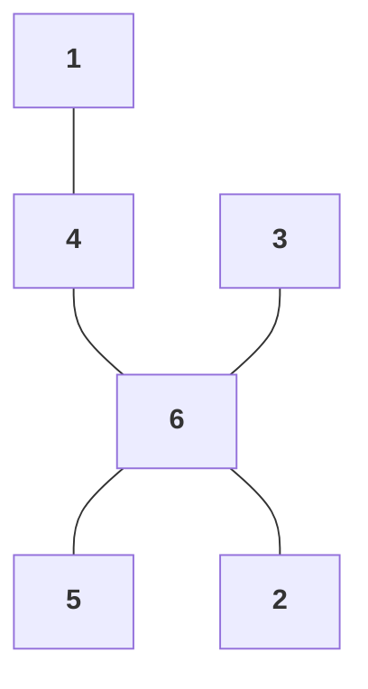
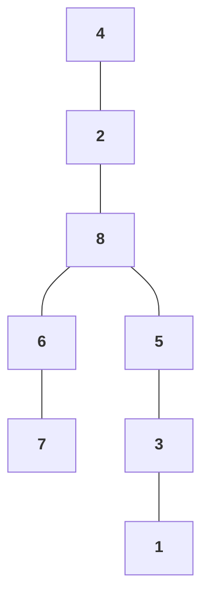
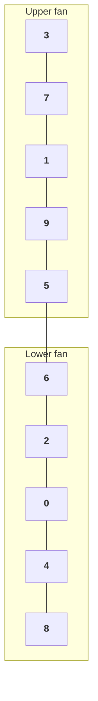
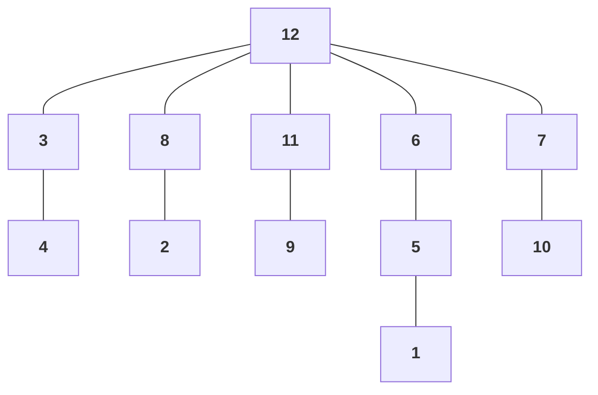
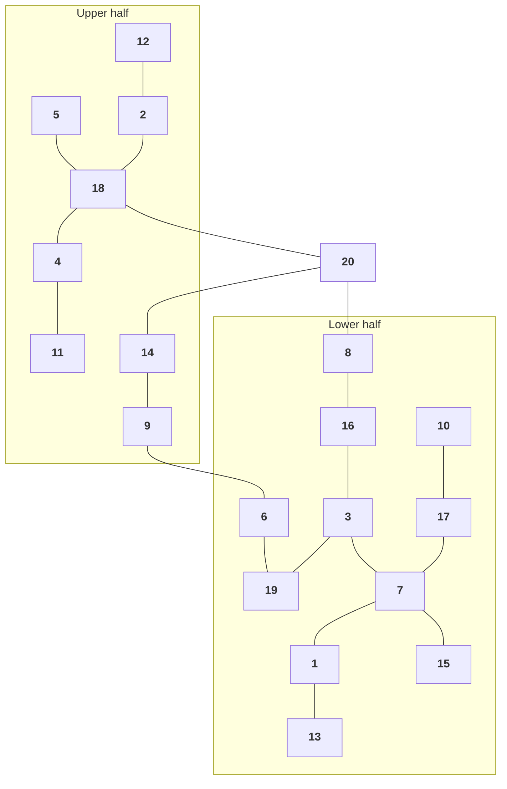

# Arcane Dice Tower

A 3D physics-driven dice tower built with [Three.js](https://threejs.org/) and [cannon-es](https://pmndrs.github.io/cannon-es/). Select polyhedral dice (D4 through D100), roll them through an animated tower with spinning baffles, and watch the results land in a collection tray -- complete with particle effects and sound.

Runs as a Vite-powered PWA.

## Features

- **Full polyhedral set** -- D4, D6, D8, D10, D12, D20, and D100 (percentile pair)
- **Real physics** -- rigid-body simulation with collision, gravity, and settlement detection
- **Animated tower** -- dice tumble through rotating baffles and a ramp before landing in the tray
- **Camera tracking** -- camera follows the dice down the tower and settles on the result
- **Effects** -- particle bursts on baffle impacts, ambient rune glow, critical hit/fail animations for D20 rolls
- **Sound** -- impact sounds, chimes on results, and special audio for natural 1s and 20s
- **Presets** -- save and recall favorite dice combinations
- **Dice viewer** -- inspect individual die geometry with a keyboard shortcut
- **PWA** -- installable, works offline

## Getting Started

```bash
npm install
npm run dev
```

Open `http://localhost:5173` in a browser with WebGL support.

## Scripts

| Command | Description |
|---|---|
| `npm run dev` | Start the Vite dev server |
| `npm run build` | Type-check and build for production |
| `npm run preview` | Preview the production build |
| `npx vitest run` | Run all tests |
| `npx vitest` | Run tests in watch mode |

## Tech Stack

- **Three.js** -- 3D rendering (scene, camera, materials, lighting)
- **cannon-es** -- Physics engine (rigid bodies, collision, settlement)
- **TypeScript** -- Strict mode
- **Vite** -- Dev server and bundler, with PWA plugin
- **Vitest** -- Test runner

## Project Structure

```
src/
├── audio/        Sound effects (lazy-init on first interaction)
├── dice/         Geometry, materials, physics bodies, result detection
├── effects/      Particles, rune glow, critical hit/fail effects
├── physics/      cannon-es world wrapper, settlement detection
├── roll/         RollOrchestrator state machine (idle -> rolling -> settled)
├── scene/        Three.js scene + camera setup
├── tower/        Tower geometry + physics (walls, baffles, ramp, tray)
├── ui/           Dynamically generated UI (selector, button, results, presets)
└── main.ts       Wires everything together
```

## D4 Tetrahedron Net

The D4 uses a realistic tetrahedron with three numbers printed per face. Each face displays the values of its three vertices. The result is the number at the top vertex of the visible faces when the die settles.



When unfolded, Face 0 sits at the center with Faces 1, 2, and 3 folding outward from its three edges. Each vertex value (1--4) appears on exactly three faces -- the three faces that share that vertex.

## D6 Cube Net

The D6 unfolds into a cross shape. Opposite faces always sum to 7 on a standard die.



The vertical spine is 1 → 4 → 6 → 2, with 3 and 5 extending left and right from the center face (6). When folded, opposite pairs sum to 7: 1/6, 2/5, 3/4.

## D8 Octahedron Net

The D8 unfolds into a strip of 8 triangles. Opposite faces sum to 9 on a standard die.



The upper strip runs 4 → 2 → 8 → 6 → 7, with a lower branch 5 → 3 → 1 hanging from the center face (8). Alternating triangles point up and down. When folded, opposite pairs sum to 9: 1/8, 2/7, 3/6, 4/5.

## D10 Trapezohedron Net

The D10 is a pentagonal trapezohedron with 10 kite-shaped faces. The net unfolds into two fans of 5 faces, connected in an S-shape. Opposite faces sum to 9.



Each fan of 5 kite faces radiates from a shared vertex. The upper fan (3, 7, 1, 9, 5) and lower fan (6, 2, 0, 4, 8) connect at their edges to form the S-shaped strip. When folded, opposite pairs sum to 9: 0/9, 1/8, 2/7, 3/6, 4/5.

## D12 Dodecahedron Net

The D12 is a regular dodecahedron with 12 pentagonal faces. The net unfolds as a central face ringed by 5 inner neighbors, with 6 outer faces branching off. Opposite faces sum to 13.



Face 12 (center) is surrounded by an inner ring of 5 faces (3, 8, 11, 6, 7). Each inner face has one outer neighbor: 3→4, 8→2, 11→9, 6→5, 7→10, with face 1 extending from 5. When folded, opposite pairs sum to 13: 1/12, 2/11, 3/10, 4/9, 5/8, 6/7.

## D20 Icosahedron Net

The D20 is a regular icosahedron with 20 triangular faces. The net unfolds as a zigzag strip from top to bottom with branches at each level. Opposite faces sum to 21.



The vertical spine descends 5 → 18 → 20 → 8 → 16 → 3 → 7 → 15. Upper band: 12, 2, 18, 4, 11. Right branch from center: 14, 9, 6. Lower band: 10, 17, 7, 1, 13. Face 19 bridges the right branch to the lower strip. When folded, opposite pairs sum to 21: 1/20, 2/19, 3/18, 4/17, 5/16, 6/15, 7/14, 8/13, 9/12, 10/11.

## License

All rights reserved. See [LICENSE.md](LICENSE.md).
